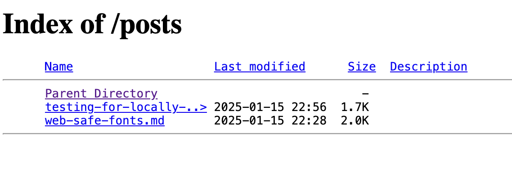

# 🐶 Lizzy.js 

Lizzy.js ([github](https://github.com/stoyan/Lizzy.js/)) is a zero-dependency, no-build, copy-paste, open-source, client-side rendering framework for listing and rendering markdown content. E.g. a blog. It's named after a dog: an opinionated feisty matted specimen, generously described as a _terrier mix_ and often being interrogated with questions including but not limitted to "who's a good girl?" and "where's the ball?"


*Zero interest in balls, btw*


## Demo

See [https://www.highperformancewebfonts.com/](https://www.highperformancewebfonts.com/) - the stuff under **Reads** is powered by Lizzy.js as are the articles when you click on them.

The Markdown sources are in [https://www.highperformancewebfonts.com/posts/](https://www.highperformancewebfonts.com/posts/).

## How it works

### Stage 1: Listing articles 

You point Lizzy.js to a directory on your Apache server that contains markdown files. Your Apache configuration allows directory listings. (Which is default in my Dreamhost setup, so there). Lizzy fetches (appropriately for a terrier mix) the listing HTML that Apache generates and displays the articles as a `<ul>` list.

Example input:



Output:


### Stage 2: Rendering an article

When the user clicks an article, Lizzy fetches (ah, cheeky little pup!) the markdown file, converts it to HTML and displays it. It also puts the aricle date on top, derived from the `Last-Modified` HTTP header. It also updates the URL of the article for bookmarking purposes.

Example:


## Features of the Lizzy.js framework

* Quick and dirty (just like its namesake. Well, the namesake is getting old so not as quick anymore, but at least one of the two is true).
* Tiny (just like the namesake). It's, like, 100 lines of code (prettified) plus 70-ish more for the markdown-to-html transform.
* Probably has a bug or two (just like the namesake after spending time with other dogs)
* No build process. To publish a new article, just drop another `.md` file. That's it.
* Supports drafts. Prefix your filename.md with a `_` and it won't be in the listing, but it will be rendered if you hit the URL directly, so you can preview your MD-foo on the live server, as it should be.
* 0 dependencies
* Trivial to instal. Copy-paste at the bottom of any HTML file.
* A breeze to configure. 3 options: where are the articles, where to render them in the given HTML, and how do you want your article URLs (permalinks) to look like.
* Additional customizability via article-related config/API
* The **Back** button works (don't you wish more client-side rendered apps do this? Is it too much to ask? Is it?)
* Automatically shows the dates of articles
* AI-powered (I asked chatgpt a few things during development)
* TypeScript-free (no build, remember?)
* SEO-free (all client-side rendered, so SEO is out the window but who cares)
* `package.json`-free. Just like the namesake, anything touched by a mailman is suspect

## Installation

Copy the contents of [`lizzy.js`](lizzy.js) and paste it into an HTML of your liking: a `<script>` tag in an `index.html` most likely

## Configuration

MVC (minimal viable config):

```js
// Lizzy.js config
window.__lizzyconf = {
  index: '/posts/', // where are the articles on the server
  root: document.getElementById('root'), // render the app here
  read: '/read/', // for bookmarking article URLs
};
```

When you configure Lizzy.js as above (and your domain is `example.org`) it means that you keep your MD files in `example.org/posts`. When the user clicks a link to, say, `hello-lizzy.md` the URL of the rendered article becomes `https://example.org/read/hello-lizzy`


For the additional configuration/API, see the [`examples/config.js`](./examples/config.js) folder in this repo.

## Optional Apache thing

If you want to render an article when people hit `https://example.org/read/hello-lizzy` directly, you need to rewrite the URLs to point to the original HTML, e.g. `index.html` that has Lizzy.js napping in it.

Do this in `.htaccess` or similar:

```
RewriteEngine On

# Match all requests starting with "/read/"
RewriteRule ^read/ index.html [L]
```

## Hmmm, grrr

Now this README has about as many lines as the framework

Love,
🐶
